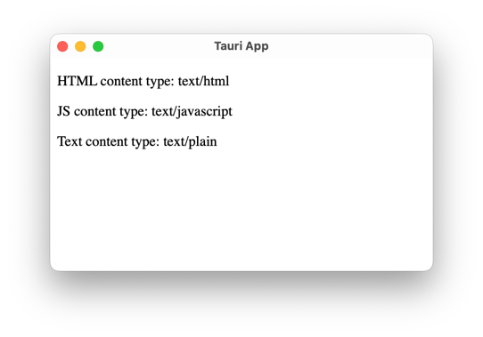
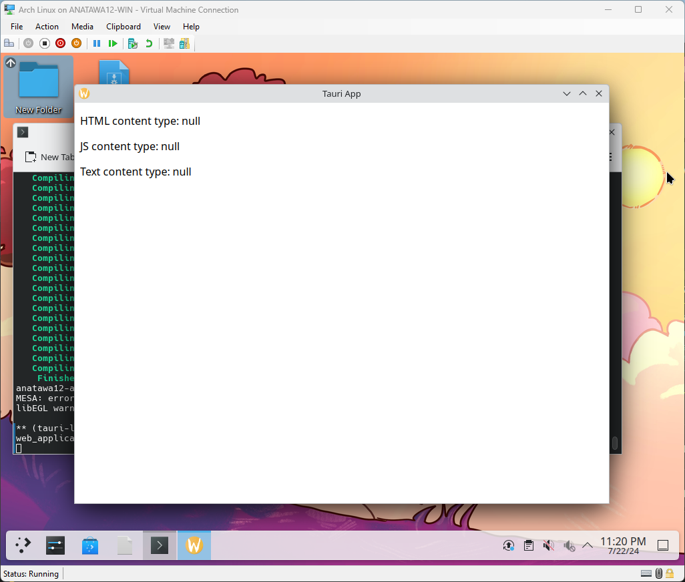

# tauri content-type on linux test

This is a test project to test Content-Type response header/field value for each file type

## Building

```shell
# install tauri-cli
cargo install tauri-cli
cd simple # or cd nextjs
cargo tauri build
```

## The problem

When you run the built binary for linux, content-type field for all files are missing

This will cause the next.js would not work as SPA, every time refreshes entire page.

## Structure of this repository

### simple

The simple folder contains a simple tauri app that shows the content-type for html, js and txt file.

On macOS, it will show `text/html`, `text/javascript` and `text/plain` respectively.



However, on linux, it will show null. content-type field is missing.



### nextjs

The nextjs folder contains a simple tauri + next.js app that shows this bug would cause page refresh every time.

To show that, the next.js app contains client-side component that will show alert on the layout.tsx,
which will not be rendered on page transition with SPA mode.
